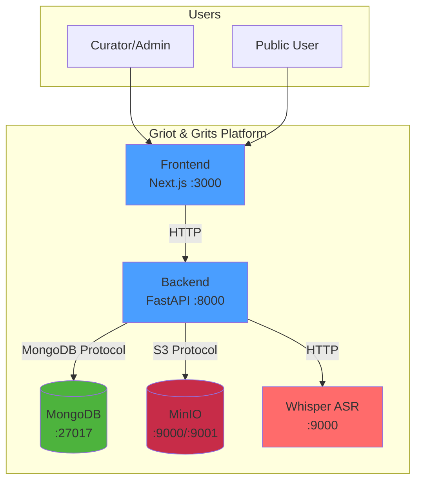

# Container Diagram

> Internal services and their connections within the Griot & Grits platform.

## Overview

The platform consists of 5 main containers deployed on OpenShift.

## Diagram

## Service Details

| Service | Technology | Port | Purpose |
|---------|------------|------|---------|
| Frontend | Next.js | 3000 | Web UI for curators and public |
| Backend | FastAPI (Python) | 8000 | REST API, business logic |
| MongoDB | MongoDB 6.0 | 27017 | Document database for artifacts |
| MinIO | MinIO | 9000 (API), 9001 (Console) | S3-compatible object storage |
| Whisper | Whisper ASR | 9000 | Speech-to-text transcription |

## Communication Protocols

- **Frontend <-> Backend**: HTTPS (REST API)
- **Backend <-> MongoDB**: MongoDB Wire Protocol
- **Backend <-> MinIO**: S3 API (HTTP)
- **Backend <-> Whisper**: HTTP (multipart/form-data)

---

← [Back to Documentation Index](../README.md)
