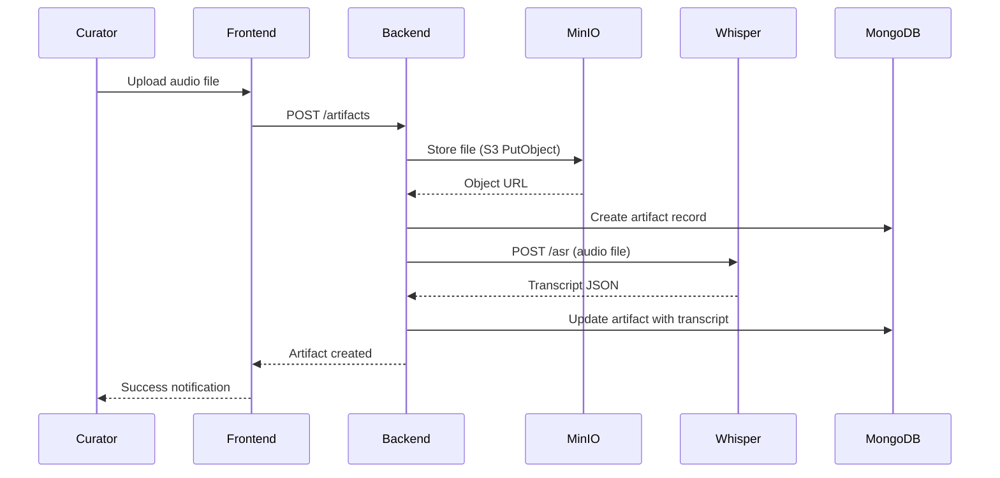
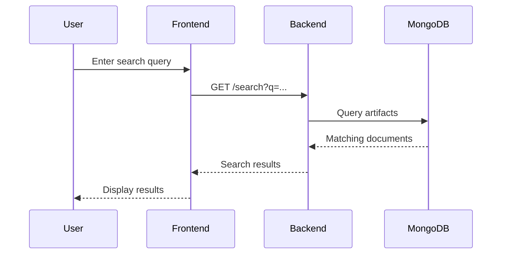
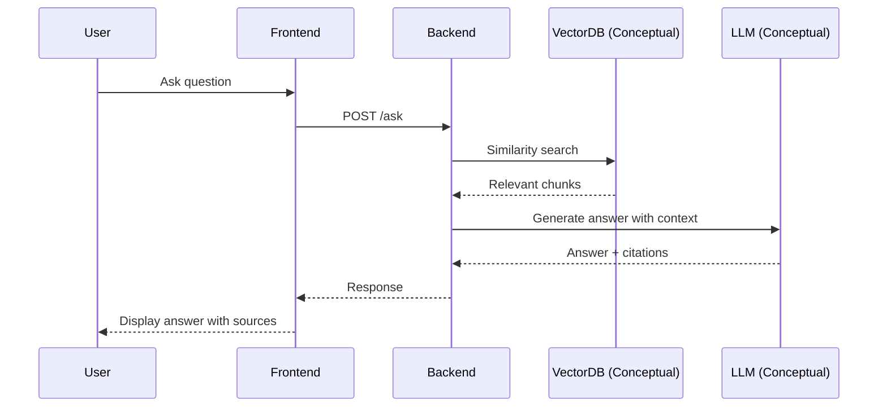

# Data Flow Diagrams

> How data moves through the Griot & Grits system.

## 1. Artifact Ingestion Flow

When a curator uploads an oral history recording:

## 2. Search Flow

When a user searches the collection:

## 3. "Ask the Griot" Flow (RAG)

> **Note**: This flow is conceptual. The VectorDB and LLM components are future integrations and not currently deployed in this repository.

When a user asks a question:

---

← [Back to Documentation Index](../README.md)
