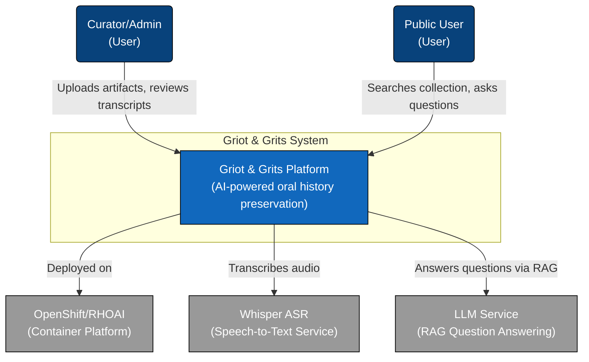

# System Context Diagram

> High-level view of Griot & Grits and its external interactions.

## Overview

The Griot & Grits system preserves minority oral history through AI-powered transcription and semantic search.

## Diagram

## Actors

| Actor | Description |
|-------|-------------|
| Curator/Admin | Museum staff who upload and curate oral history recordings |
| Public User | Researchers and public exploring the collection |

## External Systems

| System | Purpose |
|--------|---------|
| OpenShift/RHOAI | Hosts all containerized services |
| Whisper ASR | Converts audio to text transcripts |
| LLM Service | Provides "Ask the Griot" RAG functionality |

---

← [Back to Documentation Index](../README.md)
